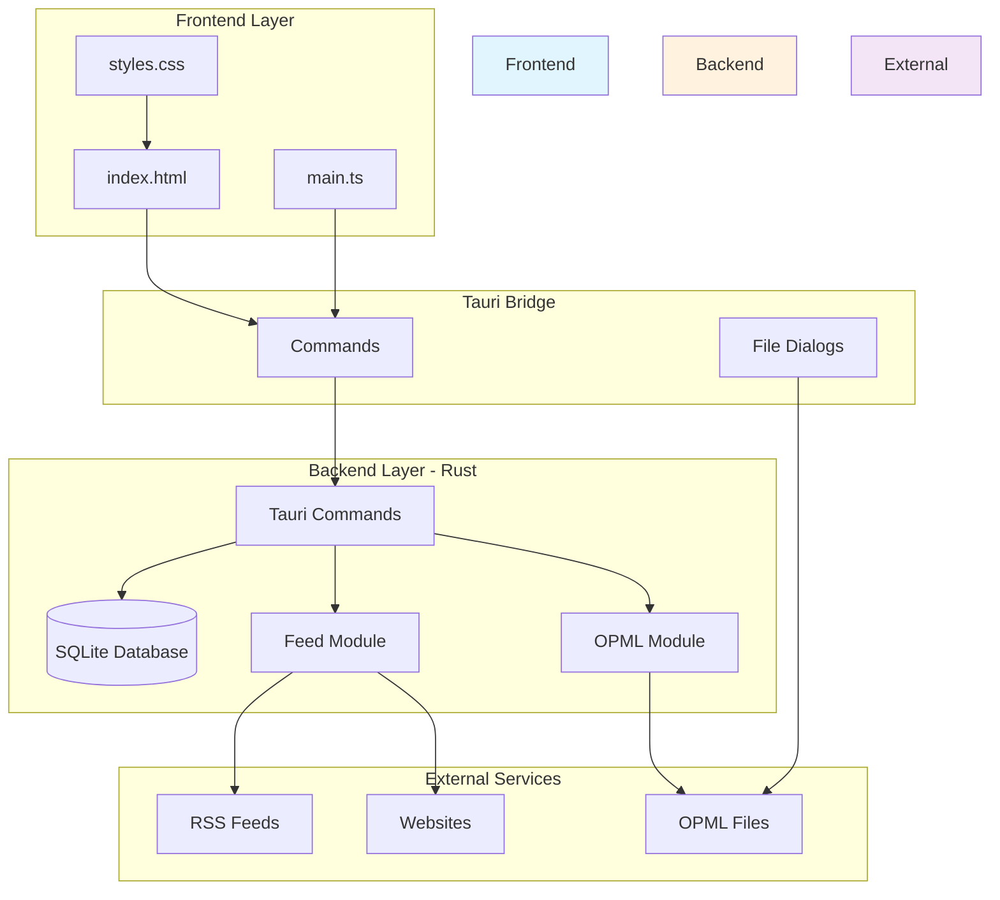
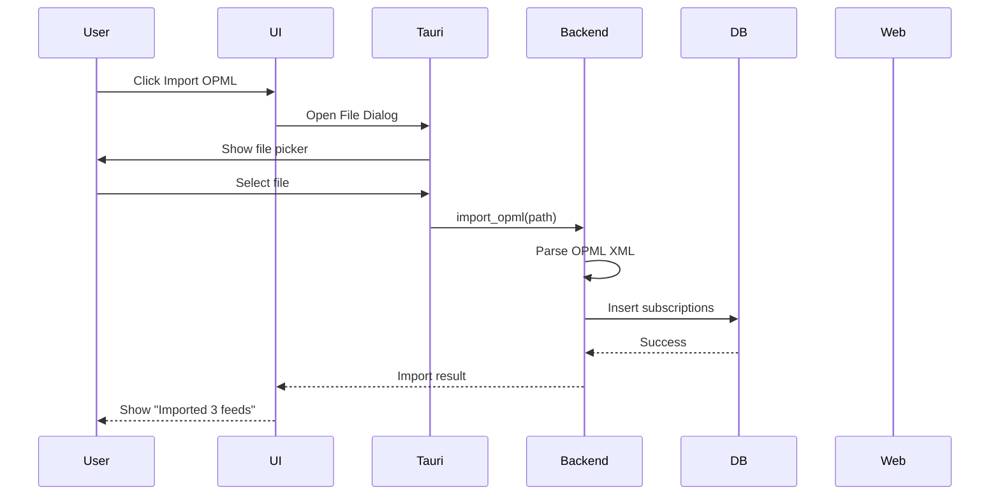
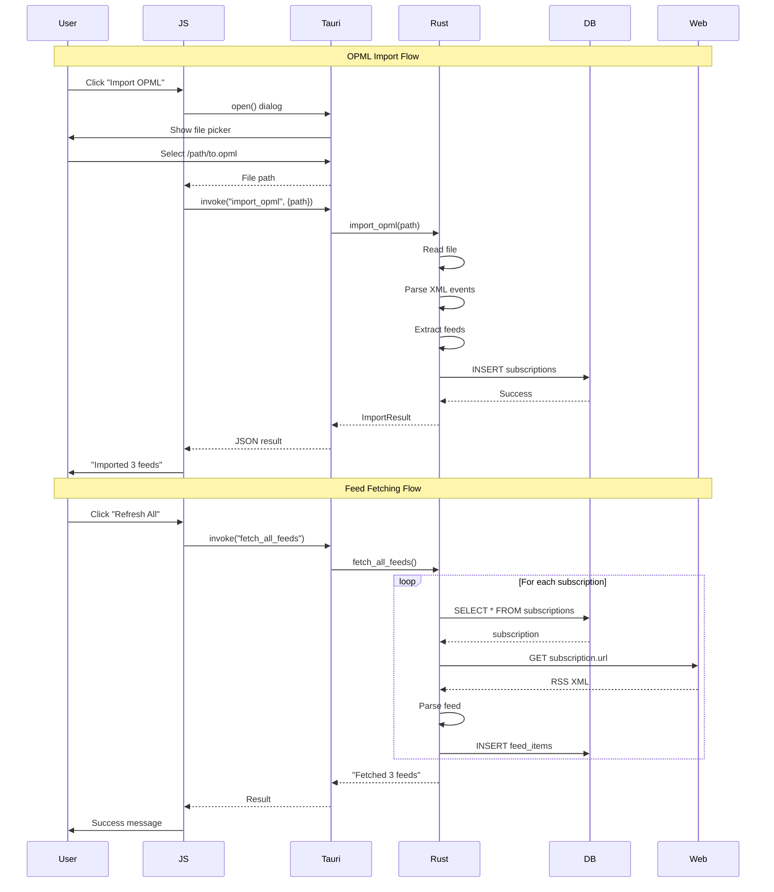

# RSS Reader Project - Complete Technical Overview

## Table of Contents
1. [Project Overview](#project-overview)
2. [Tech Stack Explained](#tech-stack-explained)
3. [Architecture](#architecture)
4. [Module Structure](#module-structure)
5. [Detailed Component Breakdown](#detailed-component-breakdown)
6. [Data Flow](#data-flow)
7. [Development Workflow](#development-workflow)

---

## Project Overview

This is a **cross-platform desktop RSS reader** application built with Tauri. It allows users to:
- Subscribe to RSS/Atom feeds
- Import/export subscriptions in OPML format
- Fetch and read feed articles
- Search across all articles
- Distinguish between RSS content and website-extracted content

**Key Features:**
- 🖥️ Works on Linux, macOS, and Windows
- 📰 Reads RSS/Atom feeds from any URL
- 📥 Imports OPML files (from Feedly, Inoreader, etc.)
- 📤 Exports subscriptions to OPML format
- 🔍 Full-text search across articles
- 💾 Local SQLite database for persistence

---

## Tech Stack Explained

### What is Tauri?

**Tauri** is a framework for building desktop applications using web technologies. Similar to Electron, but much smaller and more efficient.

```
┌─────────────────────────────────────┐
│   Desktop Application Window        │
├─────────────────────────────────────┤
│                                     │
│   ┌─────────────────────────────┐  │
│   │  Frontend (WebView)          │  │
│   │  - HTML                     │  │
│   │  - CSS                      │  │
│   │  - JavaScript               │  │
│   └─────────────────────────────┘  │
│             ▲                       │
│             │ Tauri Bridge          │
│             ▼                       │
│   ┌─────────────────────────────┐  │
│   │  Rust Backend               │  │
│   │  - Business Logic           │  │
│   │  - File System Access       │  │
│   │  - Network Requests         │  │
│   └─────────────────────────────┘  │
└─────────────────────────────────────┘
```

**Why Tauri?**
- **Small bundle size**: ~3MB vs ~100MB+ for Electron
- **Security**: Sandboxed Rust backend
- **Performance**: Rust for heavy operations
- **Web standards**: Use familiar web tech for UI

### Technology Stack

| Component | Technology | Purpose |
|-----------|-----------|---------|
| **Frontend Framework** | Vanilla JavaScript + HTML/CSS | User interface |
| **Desktop Framework** | Tauri 2.x | Bridge between web and native |
| **Backend Language** | Rust | Business logic, performance |
| **Database** | SQLite via SQLx | Data persistence |
| **XML Parsing** | feed-rs, quick-xml | RSS/Atom and OPML parsing |
| **HTTP Client** | reqwest | Fetch feeds and websites |
| **HTML Parsing** | scraper | Extract website content |
| **Async Runtime** | tokio | Asynchronous operations |

---

## Architecture

### High-Level Architecture Diagram



### Data Flow



---

## Module Structure

### Project File Tree

```
rss-reader/
├── src/                          # Frontend source
│   ├── index.html               # Main UI structure
│   ├── main.ts                  # Frontend logic
│   └── styles.css               # Styling
│
├── src-tauri/                   # Rust backend
│   ├── src/
│   │   ├── lib.rs              # Main entry point
│   │   │
│   │   ├── database/           # Database layer
│   │   │   ├── mod.rs          # Module exports
│   │   │   ├── schema.rs       # Data models
│   │   │   └── migrations.rs   # Database setup
│   │   │
│   │   ├── feed/               # Feed handling
│   │   │   ├── mod.rs          # Module exports
│   │   │   ├── fetcher.rs      # HTTP fetching
│   │   │   ├── parser.rs       # RSS/Atom parsing
│   │   │   └── rsshub.rs       # RSSHub integration
│   │   │
│   │   ├── opml/               # OPML import/export
│   │   │   ├── mod.rs          # Module exports
│   │   │   ├── importer.rs     # Parse OPML files
│   │   │   └── exporter.rs     # Generate OPML files
│   │   │
│   │   └── commands/           # Tauri commands
│   │       ├── mod.rs          # Module exports
│   │       ├── subs.rs         # Subscription management
│   │       ├── feeds.rs        # Feed fetching
│   │       ├── items.rs        # Item queries
│   │       └── opml.rs         # OPML operations
│   │
│   ├── Cargo.toml              # Rust dependencies
│   └── tauri.conf.json         # Tauri configuration
│
├── package.json                # Node.js dependencies
└── tsconfig.json              # TypeScript config
```

---

## Detailed Component Breakdown

### 1. Frontend Layer

#### index.html
The UI structure of the application.

```html
<body>
  <!-- Sidebar: Subscription list -->
  <aside id="sidebar">
    <button id="add-feed-btn">Add Feed</button>
    <button id="import-opml-btn">Import OPML</button>
    <button id="export-opml-btn">Export OPML</button>
    <button id="refresh-all-btn">Refresh All</button>
    <div id="subscription-list"></div>
  </aside>

  <!-- Main content: Article list -->
  <main>
    <input id="search-input" placeholder="Search articles...">
    <h2 id="current-feed-title">All Items</h2>
    <div id="items-list"></div>
  </main>

  <!-- Detail panel: Article content -->
  <aside id="item-detail">
    <button id="close-detail">×</button>
    <div id="item-detail-content"></div>
  </aside>

  <!-- Modal: Add new feed -->
  <dialog id="add-feed-modal">
    <form id="add-feed-form">
      <!-- Form fields -->
    </form>
  </dialog>
</body>
```

**Key Sections:**
- **Sidebar**: Shows all subscriptions, action buttons
- **Main area**: Lists feed items with search
- **Detail panel**: Full article content
- **Modal**: Add new subscription form

#### main.ts
Frontend application logic.

```typescript
// Data structures (TypeScript interfaces)
interface Subscription {
  id: number;
  url: string;
  title: string | null;
  website_url: string | null;
  rsshub_url: string | null;
  use_website: boolean;
  // ...
}

interface FeedItem {
  id: number;
  subscription_id: number;
  title: string;
  link: string | null;
  content: string | null;
  // ...
}

// Core functions
async function loadSubscriptions() {
  // Calls Rust: list_subscriptions()
  const subs = await invoke("list_subscriptions");
  renderSubscriptions(subs);
}

async function importOpml() {
  // Opens file dialog
  const filePath = await open({ /* ... */ });
  // Calls Rust: import_opml(filePath)
  const result = await invoke("import_opml", { filePath });
  showSuccess(`Imported ${result.imported} subscriptions`);
}

async function fetchAllFeeds() {
  // Calls Rust: fetch_all_feeds()
  await invoke("fetch_all_feeds");
  await loadItems();
}
```

**How Tauri Bridge Works:**

```typescript
// Frontend calls Rust backend
import { invoke } from "@tauri-apps/api/core";

// Simple command with no parameters
const subscriptions = await invoke("list_subscriptions");

// Command with parameters
const result = await invoke("import_opml", {
  filePath: "/path/to/file.opml"
});

// Command that returns data
const items = await invoke("get_items", {
  subscriptionId: 1,
  limit: 50
});
```

#### styles.css
Responsive styling with dark/light theme support.

```css
/* CSS Custom Properties for theming */
:root {
  --bg-primary: #ffffff;
  --bg-secondary: #f5f5f5;
  --text-primary: #333333;
  --accent: #2196F3;
}

@media (prefers-color-scheme: dark) {
  :root {
    --bg-primary: #1e1e1e;
    --bg-secondary: #2d2d2d;
    --text-primary: #e0e0e0;
    --accent: #64B5F6;
  }
}

/* Layout */
body {
  display: grid;
  grid-template-columns: 250px 1fr 400px;
  height: 100vh;
}
```

---

### 2. Tauri Bridge Layer

#### lib.rs
Main entry point for the Rust backend.

```rust
// Prevents console window on Windows
#![cfg_attr(not(debug_assertions), windows_subsystem = "windows")]

// Import all modules
mod database;
mod feed;
mod opml;
mod commands;

use database::init_database;
use tauri::Manager;

pub fn run() {
    tauri::Builder::default()
        // Initialize plugins
        .plugin(tauri_plugin_opener::init())
        .plugin(tauri_plugin_dialog::init())
        // Setup: Initialize database
        .setup(|app| {
            let pool = tauri::async_runtime::block_on(async {
                init_database(app.handle()).await
                    .expect("Failed to initialize database")
            });
            app.manage(pool); // Store in app state
            Ok(())
        })
        // Register all Tauri commands
        .invoke_handler(tauri::generate_handler![
            add_subscription,
            remove_subscription,
            list_subscriptions,
            import_opml,
            export_opml,
            fetch_all_feeds,
            get_items,
            // ... more commands
        ])
        .run(tauri::generate_context!())
        .expect("error while running tauri application");
}
```

**What's happening here?**
1. **Module declarations**: Tell Rust about our code modules
2. **Plugin initialization**: Add Tauri plugins (file dialogs, opener)
3. **Setup callback**: Initialize database before window opens
4. **State management**: Store database connection pool in app state
5. **Command registration**: Expose Rust functions to JavaScript

---

### 3. Database Module

#### schema.rs
Data models using SQLx for compile-time checked queries.

```rust
use sqlx::FromRow;
use serde::{Serialize, Deserialize};

#[derive(Debug, Clone, Serialize, Deserialize, FromRow)]
pub struct Subscription {
    pub id: i64,
    pub url: String,
    pub title: Option<String>,
    pub website_url: Option<String>,
    pub rsshub_url: Option<String>,
    pub use_website: bool,
    pub opml_attributes: Option<String>, // JSON string
    pub created_at: DateTime<Utc>,
    pub updated_at: DateTime<Utc>,
}

#[derive(Debug, Clone, Serialize, Deserialize, FromRow)]
pub struct FeedItem {
    pub id: i64,
    pub subscription_id: i64,
    pub guid: Option<String>,
    pub title: String,
    pub link: Option<String>,
    pub content: Option<String>,
    pub description: Option<String>,
    pub author: Option<String>,
    pub published_at: Option<DateTime<Utc>>,
    pub fetched_at: DateTime<Utc>,
    pub is_website_content: bool,
}
```

**Why use derive macros?**
- `FromRow`: Auto-maps database columns to struct fields
- `Serialize/Deserialize`: JSON conversion for Tauri bridge
- `Debug`: Enable debug printing

#### mod.rs
Database connection and pool management.

```rust
use sqlx::SqlitePool;
use tauri::{AppHandle, Manager};

pub async fn init_database(app_handle: &AppHandle) -> Result<SqlitePool, DbError> {
    // Get app data directory (platform-specific)
    let app_dir = app_handle.path().app_data_dir()
        .map_err(|e| DbError::Migration(format!("Failed to get app dir: {}", e)))?;

    // Create directory if it doesn't exist
    std::fs::create_dir_all(&app_dir)
        .map_err(|e| DbError::Migration(format!("Failed to create app dir: {}", e)))?;

    // Database file path
    let db_path = app_dir.join("rss_reader.db");
    let connection_string = format!("sqlite:{}", db_path.display());

    // Create connection pool
    let options = SqliteConnectOptions::from_str(&connection_string)?
        .create_if_missing(true);
    let pool = SqlitePool::connect_with(options).await?;

    // Run migrations
    migrations::run_migrations(&pool).await?;

    Ok(pool)
}
```

**Connection Pool Explained:**

```
┌─────────────────────────────────────┐
│      SqlitePool                     │
│  ┌─────┬─────┬─────┬─────┐         │
│  │  1  │  2  │  3  │  4  │ ...     │  ← Multiple connections
│  └─────┴─────┴─────┴─────┘         │
│                                     │
│  When a command needs DB access:    │
│  1. Request connection from pool    │
│  2. Use connection for query        │
│  3. Return connection to pool       │
└─────────────────────────────────────┘
```

**Why pool connections?**
- Multiple requests can run in parallel
- Avoids opening/closing connections repeatedly
- Better performance

#### migrations.rs
Database schema creation.

```rust
pub async fn run_migrations(pool: &SqlitePool) -> Result<()> {
    // Create subscriptions table
    pool.execute(
        r#"
        CREATE TABLE IF NOT EXISTS subscriptions (
            id INTEGER PRIMARY KEY AUTOINCREMENT,
            url TEXT NOT NULL UNIQUE,
            title TEXT,
            website_url TEXT,
            rsshub_url TEXT,
            use_website BOOLEAN DEFAULT 0,
            opml_attributes TEXT,
            created_at DATETIME DEFAULT CURRENT_TIMESTAMP,
            updated_at DATETIME DEFAULT CURRENT_TIMESTAMP
        );
        "#
    ).await?;

    // Create feed_items table
    pool.execute(
        r#"
        CREATE TABLE IF NOT EXISTS feed_items (
            id INTEGER PRIMARY KEY AUTOINCREMENT,
            subscription_id INTEGER NOT NULL,
            guid TEXT,
            title TEXT NOT NULL,
            link TEXT,
            content TEXT,
            description TEXT,
            author TEXT,
            published_at DATETIME,
            fetched_at DATETIME DEFAULT CURRENT_TIMESTAMP,
            is_website_content BOOLEAN DEFAULT 0,
            FOREIGN KEY (subscription_id) REFERENCES subscriptions(id) ON DELETE CASCADE
        );
        "#
    ).await?;

    // Create indexes for performance
    pool.execute(
        "CREATE INDEX IF NOT EXISTS idx_feed_items_subscription ON feed_items(subscription_id);"
    ).await?;

    pool.execute(
        "CREATE INDEX IF NOT EXISTS idx_feed_items_published ON feed_items(published_at DESC);"
    ).await?;

    // Unique constraint to prevent duplicate articles
    pool.execute(
        "CREATE UNIQUE INDEX IF NOT EXISTS idx_feed_items_guid ON feed_items(subscription_id, guid);"
    ).await?;

    Ok(())
}
```

**Database Schema:**

```
┌──────────────────────────────────────────────────────┐
│  subscriptions                                       │
├──────────┬────────────────┬──────────────────────────┤
│  id      │  INTEGER       │  PRIMARY KEY             │
│  url     │  TEXT          │  UNIQUE, NOT NULL        │
│  title   │  TEXT          │  Feed name               │
│  website_url│ TEXT        │  Main website            │
│  use_website│ BOOLEAN     │  Fetch from website?     │
│  └        │  └            │  └                      │
└──────────┴────────────────┴──────────────────────────┘
                    │
                    │ FOREIGN KEY
                    ▼
┌──────────────────────────────────────────────────────┐
│  feed_items                                          │
├──────────┬────────────────┬──────────────────────────┤
│  id      │  INTEGER       │  PRIMARY KEY             │
│  sub_id  │  INTEGER       │  → subscriptions(id)     │
│  guid    │  TEXT          │  Article unique ID       │
│  title   │  TEXT          │  Article title           │
│  content │  TEXT          │  Full content            │
│  is_website_content│ BOOL │  Source of content       │
└──────────┴────────────────┴──────────────────────────┘
```

---

### 4. Feed Module

#### fetcher.rs
HTTP client for fetching feeds and websites.

```rust
pub struct FeedFetcher {
    client: reqwest::Client,
}

impl FeedFetcher {
    pub fn new() -> Self {
        let client = reqwest::Client::builder()
            .user_agent("RSS Reader/1.0")
            .timeout(Duration::from_secs(30))
            .build()
            .unwrap();

        Self { client }
    }

    // Fetch RSS/Atom feed
    pub async fn fetch_feed(&self, url: &str) -> Result<String, FetchError> {
        let response = self.client
            .get(url)
            .header("Accept", "application/rss+xml, application/atom+xml, application/xml")
            .send()
            .await?;

        if !response.status().is_success() {
            return Err(FetchError::HttpError(response.status()));
        }

        let content = response.text().await?;
        Ok(content)
    }

    // Fetch website and extract main content
    pub async fn fetch_website_content(&self, url: &str) -> Result<String, FetchError> {
        let response = self.client
            .get(url)
            .header("Accept", "text/html")
            .send()
            .await?;

        let html = response.text().await?;
        self.extract_main_content(&html)
    }

    // Extract main article content from HTML
    fn extract_main_content(&self, html: &str) ->Result<String, FetchError> {
        let document = Html::parse_document(html);

        // Try common content selectors
        let selectors = vec![
            "article",
            "[role='main']",
            "main",
            ".post-content",
            ".entry-content",
            ".article-content",
            ".content",
            "#content",
        ];

        for selector_str in selectors {
            let selector = Selector::parse(selector_str).unwrap();
            if let Some(element) = document.select(&selector).next() {
                let content = element.text().collect::<Vec<_>>().join("\n");
                if !content.trim().is_empty() {
                    return Ok(content);
                }
            }
        }

        Err(FetchError::NoContent)
    }
}
```

**HTTP Request Flow:**

```
┌──────────────┐
│ Frontend     │
│ "Refresh"    │
└──────┬───────┘
       │ invoke("fetch_all_feeds")
       ▼
┌──────────────┐
│ commands.rs  │
│ Get all subs │
└──────┬───────┘
       │
       ▼
┌──────────────┐
│ fetcher.rs   │
│ HTTP GET     │◄─────┐
└──────┬───────┘      │
       │              │
       ▼              │
┌──────────────┐      │
│ RSS Feed     │      │
│ (XML)        │──────┘
└──────────────┘
```

#### parser.rs
Parse RSS/Atom feeds using feed-rs library.

```rust
use feed_rs::parser;

pub fn parse(feed_content: &str, subscription_id: i64) -> Result<Vec<NewFeedItem>, ParseError> {
    // feed-rs automatically detects RSS vs Atom
    let feed = parser::parse(feed_content.as_bytes())
        .map_err(|e| ParseError::FeedError(e.to_string()))?;

    let mut items = Vec::new();

    for entry in feed.entries {
        // Prefer content, fallback to description
        let content = entry.content
            .and_then(|c| c.body)
            .or(entry.summary.map(|s| s.content));

        // Use ID if available, otherwise use link
        let guid = if entry.id.is_empty() {
            entry.links.first().map(|l| l.href.clone())
        } else {
            Some(entry.id.clone())
        };

        let item = NewFeedItem {
            subscription_id,
            guid,
            title: entry.title.map(|t| t.content).unwrap_or_else(|| "Untitled".to_string()),
            link: entry.links.first().map(|l| l.href.clone()),
            content,
            author: entry.authors.first().map(|a| a.name.clone()),
            published_at: entry.published,
            is_website_content: false,
        };

        items.push(item);
    }

    Ok(items)
}
```

**Feed Format Handling:**

```
┌────────────────────────────────────────┐
│         feed-rs Library                │
├────────────────────────────────────────┤
│                                        │
│  RSS 2.0    Atom    RSS 1.0           │
│    │          │         │              │
│    └──────────┴─────────┘              │
│              │                          │
│              ▼                          │
│       Unified Entry                    │
│       - title                          │
│       - content                        │
│       - link                           │
│       - published                      │
│       - author                         │
└────────────────────────────────────────┘
```

---

### 5. OPML Module

#### importer.rs
Parse OPML files with manual XML event parsing.

```rust
use quick_xml::events::Event;
use quick_xml::Reader;

pub fn parse_opml(opml_content: &str) -> Result<OpmlImportResult, OpmlImportError> {
    let mut reader = Reader::from_str(opml_content);
    reader.config_mut().trim_text(false);

    let mut results: Vec<Outline> = Vec::new();
    let mut stack: Vec<Outline> = Vec::new();
    let mut buf = Vec::new();

    loop {
        match reader.read_event_into(&mut buf) {
            // Handle start tags and self-closing tags
            Ok(Event::Start(e)) | Ok(Event::Empty(e)) => {
                if e.name().as_ref() == b"outline" {
                    let mut outline = Outline {
                        text: None,
                        xml_url: None,
                        html_url: None,
                        children: Vec::new(),
                    };

                    // Extract attributes
                    for attr in e.attributes().with_checks(false).flatten() {
                        let key = std::str::from_utf8(attr.key.as_ref())?;
                        let value = std::str::from_utf8(&attr.value)?;

                        match key {
                            "text" => outline.text = Some(value.to_string()),
                            "xmlUrl" => outline.xml_url = Some(value.to_string()),
                            "htmlUrl" => outline.html_url = Some(value.to_string()),
                            _ => {}
                        }
                    }

                    stack.push(outline);
                }
            }

            // Handle end tags
            Ok(Event::End(e)) => {
                if e.name().as_ref() == b"outline" {
                    if let Some(child) = stack.pop() {
                        if stack.is_empty() {
                            results.push(child);
                        } else {
                            stack.last_mut().unwrap().children.push(child);
                        }
                    }
                }
            }

            Ok(Event::Eof) => break,
            Err(e) => return Err(OpmlImportError::XmlError(e)),
            _ => {}
        }
        buf.clear();
    }

    // Extract feeds from tree
    let mut feeds = Vec::new();
    for outline in &results {
        extract_feeds(outline, &mut feeds);
    }

    Ok(OpmlImportResult { feeds, errors: Vec::new() })
}
```

**OPML Parsing Process:**

```
OPML File:
┌─────────────────────────────────┐
│ <opml>                          │
│   <body>                        │
│     <outline text="News">       │ ← Folder (no xmlUrl)
│       <outline text="HN"        │ ← Feed (has xmlUrl)
│               xmlUrl="..."/>    │
│     </outline>                  │
│   </body>                       │
│ </opml>                         │
└─────────────────────────────────┘
              │
              ▼ Parser
┌─────────────────────────────────┐
│  Event Stream:                  │
│  1. Start(opml)                │
│  2. Start(body)                │
│  3. Start(outline "News")      │ ← Push to stack
│  4. Empty(outline "HN" ...)    │ ← Push, then pop immediately
│  5. End(outline)              │ ← Pop "News"
│  6. End(body)                  │
│  7. End(opml)                  │
└─────────────────────────────────┘
              │
              ▼ Extract feeds
┌─────────────────────────────────┐
│  Feed List:                    │
│  - Hacker News                  │
└─────────────────────────────────┘
```

**Why manual parsing?**

OPML stores data in XML attributes, not elements:
```xml
<!-- OPML uses attributes -->
<outline text="Title" xmlUrl="http://..." />

<!-- Regular XML uses elements -->
<outline>
  <text>Title</text>
  <xmlUrl>http://...</xmlUrl>
</outline>
```

Serde (the deserialization library) doesn't handle attributes well, so we parse manually.

---

### 6. Commands Module

This module exposes Rust functions to JavaScript via Tauri commands.

#### subs.rs
Subscription management commands.

```rust
use sqlx::SqlitePool;
use crate::database::schema::{Subscription, NewSubscription};

#[tauri::command]
pub async fn add_subscription(
    pool: tauri::State<'_, SqlitePool>,  // ← Injected from app state
    url: String,
    title: Option<String>,
    website_url: Option<String>,
    use_website: Option<bool>,
) -> Result<Subscription, String> {
    // Insert into database
    let subscription = sqlx::query_as::<_, Subscription>(
        r#"
        INSERT INTO subscriptions (url, title, website_url, use_website)
        VALUES ($1, $2, $3, $4)
        RETURNING *
        "#
    )
    .bind(&url)
    .bind(&title)
    .bind(&website_url)
    .bind(use_website.unwrap_or(false))
    .fetch_one(pool.inner())  // ← Get connection from pool
    .await
    .map_err(|e| e.to_string())?;

    Ok(subscription)
}

#[tauri::command]
pub async fn list_subscriptions(
    pool: tauri::State<'_, SqlitePool>,
) -> Result<Vec<Subscription>, String> {
    let subscriptions = sqlx::query_as::<_, Subscription>(
        "SELECT * FROM subscriptions ORDER BY title"
    )
    .fetch_all(pool.inner())
    .await
    .map_err(|e| e.to_string())?;

    Ok(subscriptions)
}

#[tauri::command]
pub async fn remove_subscription(
    pool: tauri::State<'_, SqlitePool>,
    id: i64,
) -> Result<(), String> {
    sqlx::query("DELETE FROM subscriptions WHERE id = $1")
        .bind(id)
        .execute(pool.inner())
        .await
        .map_err(|e| e.to_string())?;

    Ok(())
}
```

**Tauri Command Attributes:**

```rust
#[tauri::command]
//     ↓
//  Generates glue code to:
//  1. Accept JSON from JavaScript
//  2. Deserialize to Rust types
//  3. Execute function
//  4. Serialize result to JSON
//  5. Return to JavaScript
```

#### feeds.rs
Feed fetching commands.

```rust
#[tauri::command]
pub async fn fetch_all_feeds(
    pool: tauri::State<'_, SqlitePool>,
) -> Result<String, String> {
    // Get all subscriptions
    let subscriptions = sqlx::query_as::<_, Subscription>(
        "SELECT * FROM subscriptions"
    )
    .fetch_all(pool.inner())
    .await
    .map_err(|e| e.to_string())?;

    let fetcher = FeedFetcher::new();
    let mut fetched = 0;
    let mut errors = 0;

    for sub in subscriptions {
        // Fetch feed content
        let feed_content = fetcher.fetch_feed(&sub.url).await;

        match feed_content {
            Ok(content) => {
                // Parse feed
                match parser::parse(&content, sub.id) {
                    Ok(items) => {
                        // Insert items into database
                        for item in items {
                            // Handle duplicates with upsert
                            sqlx::query(
                                r#"
                                INSERT INTO feed_items
                                (subscription_id, guid, title, link, content, description, author, published_at, is_website_content)
                                VALUES ($1, $2, $3, $4, $5, $6, $7, $8, $9)
                                ON CONFLICT(subscription_id, guid) DO UPDATE SET
                                    title = excluded.title,
                                    content = excluded.content,
                                    updated_at = CURRENT_TIMESTAMP
                                "#
                            )
                            .bind(&item.subscription_id)
                            .bind(&item.guid)
                            .bind(&item.title)
                            // ... more bindings
                            .execute(pool.inner())
                            .await
                            .ok();
                        }
                        fetched += 1;
                    }
                    Err(e) => {
                        eprintln!("Failed to parse feed {}: {}", sub.url, e);
                        errors += 1;
                    }
                }
            }
            Err(e) => {
                eprintln!("Failed to fetch {}: {}", sub.url, e);
                errors += 1;
            }
        }
    }

    Ok(format!("Fetched {} feeds, {} errors", fetched, errors))
}
```

---

## Data Flow

### Complete Request Lifecycle



---

## Development Workflow

### Building the Project

```bash
# Development mode
npm run tauri dev

# What happens:
# 1. Start Vite dev server (http://localhost:1420)
# 2. Compile Rust code with cargo
# 3. Launch Tauri application
# 4. Enable hot-reload for both frontend and backend

# Production build
npm run tauri build

# What happens:
# 1. Build optimized frontend bundle
# 2. Compile Rust in release mode
# 3. Create platform-specific installer
#    - Linux: .deb, .AppImage
#    - macOS: .dmg, .app
#    - Windows: .exe, .msi
```

### File Change Workflow

```
Frontend file change (index.html, main.ts, styles.css):
┌──────────────────────┐
│ File saved           │
└──────────┬───────────┘
           │
           ▼
┌──────────────────────┐
│ Vite detects change  │
│ Hot reloads CSS/JS   │
│ ~100ms               │
└──────────────────────┘

Backend file change (Rust):
┌──────────────────────┐
│ File saved           │
└──────────┬───────────┘
           │
           ▼
┌──────────────────────┐
│ Cargo detects change │
│ Recompiles Rust      │
│ ~5-10 seconds        │
│ App restarts         │
└──────────────────────┘
```

### Debugging

```bash
# Frontend debugging
# 1. Open DevTools (F12 in app)
# 2. Console shows JavaScript logs
# 3. Network tab shows Tauri command calls

# Backend debugging
# 1. Run with RUST_LOG=debug
RUST_LOG=debug npm run tauri dev

# 2. Print to stdout (shows in terminal)
println!("Debug info: {}", value);

# 3. Use debugger
# - Set breakpoints in VS Code
# - Attach to running process
```

---

## Key Concepts for Beginners

### 1. Async/Await in Rust

```rust
// JavaScript
async function fetchFeeds() {
    const response = await fetch(url);
    return response.json();
}

// Rust (Tokio runtime)
async fn fetch_feeds() -> Result<String, Error> {
    let response = reqwest::get(url).await?;
    let text = response.text().await?;
    Ok(text)
}

// Calling async in non-async context
let result = tauri::async_runtime::block_on(async {
    fetch_feeds().await
});
```

### 2. Error Handling

```rust
// Rust uses Result<T, E> instead of try/catch
fn parse_opml(content: &str) -> Result<OpmlImport, OpmlError> {
    //                                    ↓        ↓
    //                               Success type  Error type

    // Use ? operator to propagate errors
    let opml = from_str(content)?;  // Returns error if parsing fails

    Ok(opml)  // Wrap success value
}

// Calling function with error handling
match parse_opml(content) {
    Ok(result) => println!("Success: {:?}", result),
    Err(error) => eprintln!("Error: {}", error),
}

// Or use ? to propagate
let result = parse_opml(content)?;  // Returns early on error
```

### 3. String Types in Rust

```rust
// String - heap-allocated, growable
let s1 = String::from("hello");
s1.push_str(" world");

// &str - string slice, reference
let s2 = "hello";  // Immutable

// Converting
let s3: String = s2.to_string();  // &str → String
let s4: &str = &s1;               // String → &str

// In Tauri commands
#[tauri::command]
fn example(name: String) {  // ← Owned String
    println!("{}", name);
}
```

### 4. Lifetimes (Advanced)

```rust
// Lifetimes track how long references are valid
struct Outline<'a> {
    text: Option<&'a str>,  // ← References data with lifetime 'a
}

// Most of the time, Tauri handles this for you
// When you need to store references, use String instead
struct Outline {
    text: Option<String>,  // ← Owned data, no lifetime needed
}
```

---

## Common Issues and Solutions

### Issue 1: "cannot find macro `__cmd_xxx`"

**Cause:** Command name mismatch between invocation and registration.

**Solution:**
```rust
// commands/opml.rs
#[tauri::command]
pub async fn export_opml(...) { ... }

// lib.rs - MUST use full path
.invoke_handler(tauri::generate_handler![
    commands::opml::export_opml,  // ← Correct
    export_opml_cmd,               // ← Wrong!
])
```

### Issue 2: "dialog.open not allowed"

**Cause:** Missing capability permission.

**Solution:**
```json
// src-tauri/capabilities/default.json
{
  "permissions": [
    "core:default",
    "dialog:default"  // ← Add this
  ]
}
```

### Issue 3: OPML imports 0 feeds

**Cause:** XML attributes not being parsed correctly.

**Solution:** Use manual event parsing instead of serde:
```rust
// Don't use this for attributes
#[derive(Deserialize)]
struct Outline {
    xml_url: Option<String>,  // Won't work!
}

// Use event parsing instead
for attr in e.attributes() {
    let key = std::str::from_utf8(attr.key.as_ref())?;
    if key == "xmlUrl" {
        xml_url = Some(value);
    }
}
```

---

## Next Steps for Learning

1. **Rust Basics**
   - Read "The Rust Book" (free online)
   - Understand ownership, borrowing, lifetimes

2. **Tauri Documentation**
   - https://tauri.app/
   - Guides on creating windows, menus, system tray

3. **SQLx**
   - Compile-time checked SQL queries
   - Migration patterns

4. **Frontend Integration**
   - Tauri API reference
   - State management patterns

5. **Debugging**
   - VS Code debugger setup
   - Browser DevTools for frontend

---

## Summary

This RSS Reader project demonstrates:
- ✅ Full-stack desktop app development
- ✅ Database design and migrations
- ✅ XML parsing (RSS, Atom, OPML)
- ✅ HTTP client implementation
- ✅ Cross-platform file handling
- ✅ Async/await patterns
- ✅ Error handling strategies

The architecture separates concerns cleanly:
- **Frontend**: UI and user interaction
- **Backend**: Business logic and data persistence
- **Bridge**: Tauri connects them safely

This pattern can be extended to build many types of desktop applications!
